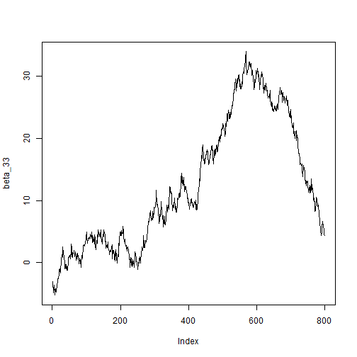

In this package we implement the method developed in the paper "Measurement Error Models with Zero Inflation and Multiple Sources of Zero with Applications to a Never Consumers problem in Nutrition". First lets load the package.


```r
library(NeverConsumers)
```

Next let us set the filepath to where ever the dataset and the file of the initial values of the variables are. 

```r

setwd("C:\\Users\\anany\\Desktop\\NeverConsumersRpkg\\R")

zz         <-  read.csv("simulated_data.csv", header = T)# Name of the data set you will load
```

Let us now tell the program where our covariates, food column, energy column, id's etc are in the dataset.

```r


X_cols          <- 2:5 # Columns where the covariates are
Food_col        <- 6 # Column where the episodic variable is
Energy_col      <- 7 # Column where energy (continuous) is
ID_col          <- 1 # Column for ID
FFQ_food_col    <- 4 # Column where the FFQ for the food is. Set = [] if no FFQ
                              # Please be aware that if there is a FFQ, you
                              # really should add this in, because FFQ have
                              # a tendency to generate massive, high
                              # leverage outliers, as in the EATS data
FFQ_energy_col  <- 5 # Column where the FFQ for energy is. Set = [] if no FFQ
                              # Please be aware that if there is a FFQ, you
                              # really should add this in, because FFQ have
                              # a tendency to generate massive, high
                              # leverage outliers, as in the EATS data
with_covariates_ind <- 3# What to include as covariates in the
                              # ever consumer model
                                # 0: a column of ones.
                                # 1: a column of ones, the FFQ, and
                                #    the indicator that the FFQ=0.
                                # 2: a column of ones and the FFQ.
                                # 3: a column of ones and the indicator
                                #    that the FFQ=0.
n_gen <- 30# Number of realizations of usual intake to
                                # generate. Must be a positive integer,
mmi             <- 4# Number of recalls, integer
```

Let us further initialize the MCMC parameters.


```r

nMCMC           <- 50000# Number of MCMC iterations. The more the better
nburn           <- 10000# Size of the burn-in
nthin           <- 50# thining
ndist           <- 200# average of the last ndist MCMC steps (after thinning)
                              # to get the cdf of usual intake
```

Next let us read the initial values of the known parameters from the file. Here, we have used a matlab file but it can easily be replaced with some other file or even by directly inputting the values. 


```r

setwd("C:\\Users\\anany\\Desktop\\NeverConsumersRpkg\\R")


lambda_rec_food   <- R.matlab::readMat("Output_4Recalls/lambda_rec_food.mat")
lambda_rec_food   <- lambda_rec_food$lambda.rec.food
lambda_rec_energy <- R.matlab::readMat("Output_4Recalls/lambda_rec_energy.mat")
lambda_rec_energy <- lambda_rec_energy$lambda.rec.energy
if (length(FFQ_food_col) > 0){
    lambda_FFQ_food   <- R.matlab::readMat("Output_4Recalls/lambda_FFQ_food.mat")
    lambda_FFQ_food   <- lambda_FFQ_food$lambda.FFQ.food
}
if (length(FFQ_energy_col) > 0){
    lambda_FFQ_energy   <- R.matlab::readMat("Output_4Recalls/lambda_FFQ_energy.mat")
    lambda_FFQ_energy   <- lambda_FFQ_energy$lambda.FFQ.energy
}
beta_temp <- R.matlab::readMat("Output_4Recalls/beta_postmean.mat")
beta_temp <- beta_temp$beta.postmean

Sigmau_temp_episodically <-R.matlab::readMat("Output_4Recalls/Sigmau_postmean.mat")
Sigmau_temp_episodically <- Sigmau_temp_episodically$Sigmau.postmean
```

Now let us run the program and save the outputs in the nC_object. We can also see the graphs of the estimated parameters to see that the method is resulting in an well mixed MCMC chain.


```r
start = proc.time()
nC_object = neverConsumers(zz, mmi, X_cols, Food_col, Energy_col, ID_col, FFQ_food_col,
               FFQ_energy_col, with_covariates_ind, n_gen, lambda_rec_food, 
               lambda_rec_energy, lambda_FFQ_food, lambda_FFQ_energy,beta_temp,
               Sigmau_temp_episodically, nMCMC = 50000)
#> There are non-positive x and the lambda is  0.000 
#> To solve the problem, the non-positive values are replaced by  
#> half of minimum of the positive values, which is  0.165 . 
#> Set the MCMC parameters 
#> [1] "Start the MCMC"
#> [1] "iteration <-  500"
#> [1] "iteration <-  1000"
#> [1] "iteration <-  1500"
#> [1] "iteration <-  2000"
#> [1] "iteration <-  2500"
#> [1] "iteration <-  3000"
#> [1] "iteration <-  3500"
#> [1] "iteration <-  4000"
#> [1] "iteration <-  4500"
#> [1] "iteration <-  5000"
#> [1] "iteration <-  5500"
#> [1] "iteration <-  6000"
#> [1] "iteration <-  6500"
#> [1] "iteration <-  7000"
#> [1] "iteration <-  7500"
#> [1] "iteration <-  8000"
#> [1] "iteration <-  8500"
#> [1] "iteration <-  9000"
#> [1] "iteration <-  9500"
#> [1] "iteration <-  10000"
#> [1] "iteration <-  10500"
#> [1] "iteration <-  11000"
#> [1] "iteration <-  11500"
#> [1] "iteration <-  12000"
#> [1] "iteration <-  12500"
#> [1] "iteration <-  13000"
#> [1] "iteration <-  13500"
#> [1] "iteration <-  14000"
#> [1] "iteration <-  14500"
#> [1] "iteration <-  15000"
#> [1] "iteration <-  15500"
#> [1] "iteration <-  16000"
#> [1] "iteration <-  16500"
#> [1] "iteration <-  17000"
#> [1] "iteration <-  17500"
#> [1] "iteration <-  18000"
#> [1] "iteration <-  18500"
#> [1] "iteration <-  19000"
#> [1] "iteration <-  19500"
#> [1] "iteration <-  20000"
#> [1] "iteration <-  20500"
#> [1] "iteration <-  21000"
#> [1] "iteration <-  21500"
#> [1] "iteration <-  22000"
#> [1] "iteration <-  22500"
#> [1] "iteration <-  23000"
#> [1] "iteration <-  23500"
#> [1] "iteration <-  24000"
#> [1] "iteration <-  24500"
#> [1] "iteration <-  25000"
#> [1] "iteration <-  25500"
#> [1] "iteration <-  26000"
#> [1] "iteration <-  26500"
#> [1] "iteration <-  27000"
#> [1] "iteration <-  27500"
#> [1] "iteration <-  28000"
#> [1] "iteration <-  28500"
#> [1] "iteration <-  29000"
#> [1] "iteration <-  29500"
#> [1] "iteration <-  30000"
#> [1] "iteration <-  30500"
#> [1] "iteration <-  31000"
#> [1] "iteration <-  31500"
#> [1] "iteration <-  32000"
#> [1] "iteration <-  32500"
#> [1] "iteration <-  33000"
#> [1] "iteration <-  33500"
#> [1] "iteration <-  34000"
#> [1] "iteration <-  34500"
#> [1] "iteration <-  35000"
#> [1] "iteration <-  35500"
#> [1] "iteration <-  36000"
#> [1] "iteration <-  36500"
#> [1] "iteration <-  37000"
#> [1] "iteration <-  37500"
#> [1] "iteration <-  38000"
#> [1] "iteration <-  38500"
#> [1] "iteration <-  39000"
#> [1] "iteration <-  39500"
#> [1] "iteration <-  40000"
#> [1] "iteration <-  40500"
#> [1] "iteration <-  41000"
#> [1] "iteration <-  41500"
#> [1] "iteration <-  42000"
#> [1] "iteration <-  42500"
#> [1] "iteration <-  43000"
#> [1] "iteration <-  43500"
#> [1] "iteration <-  44000"
#> [1] "iteration <-  44500"
#> [1] "iteration <-  45000"
#> [1] "iteration <-  45500"
#> [1] "iteration <-  46000"
#> [1] "iteration <-  46500"
#> [1] "iteration <-  47000"
#> [1] "iteration <-  47500"
#> [1] "iteration <-  48000"
#> [1] "iteration <-  48500"
#> [1] "iteration <-  49000"
#> [1] "iteration <-  49500"
#> [1] "iteration <-  50000"
#> MCMC completed 
#>   
#>   
#>   
#>   
#>   
#>   
#>   
#>   
#>   
#>   
#>   
#>   
#>   
#> 
```



```r
print(proc.time() - start)
#>    user  system elapsed 
#>   88.11    0.18   88.34
```

Let us finally extract the estimated parameters from the nC_object. The program gives us the posterior means, standard deviations and confidence intervals of the parameters \alpha, \beta, \sigma_u, \sigma_e, the probability of being a never consumer, the usual intake o food, energy and the ratio of food and energy. It also computes the distribution of usual intake of food, energy and food/(energy/1000).
  


```r
alpha_postmean = nC_object$alpha_postmean
alpha_postsd = nC_object$alpha_postsd
alpha_ci = nC_object$alpha_ci
never_postmean = nC_object$never_postmean  
never_postsd = nC_object$never_postsd
never_ci = nC_object$never_ci
beta_postmean = nC_object$beta_postmean
beta_postsd = nC_object$beta_postsd
beta_ci = nC_object$beta_ci
Sigmau_postmean = nC_object$Sigmau_postmean
Sigmau_postsd = nC_object$Sigmau_postsd
Sigmau_ci = nC_object$Sigmau_ci
Sigmae_postmean = nC_object$Sigmae_postmean
Sigmae_postsd = nC_object$Sigmae_postsd
Sigmae_ci = nC_object$Sigmae_ci
mu_ui_food = nC_object$mu_ui_food
sig_ui_food = nC_object$sig_ui_food
mu_ui_energy = nC_object$mu_ui_energy
sig_ui_energy = nC_object$sig_ui_energy
mu_ui_ratio = nC_object$mu_ui_ratio
sig_ui_ratio = nC_object$sig_ui_ratio
food_distribution = nC_object$food_distribution 
energy_distribution = nC_object$energy_distribution
ratio_distribution = nC_object$ratio_distribution
  
```


The posterior mean, standard deviation and a 95% CI for the probability of being a never consumer is then estimated as the following from our simulated dataset.

```r
never_postmean
#> [1] 0.428127
never_postsd
#> [1] 0.130913
never_ci
#>      2.5%     97.5% 
#> 0.1680293 0.6729395
```

Similarly the posterior mean, standard deviation and a 95% CI of our \beta is then estimated as the following:

```r
beta_postmean
#>            [,1]       [,2]       [,3]
#> [1,] -37.158231 -32.102605 -20.755043
#> [2,]  56.839952  36.491860  28.901704
#> [3,]  22.198727  17.726859  12.428464
#> [4,]   5.188319   6.981816   3.530611
#> [5,] -23.108061 -14.837110 -11.277973
beta_postsd
#>          [,1]      [,2]      [,3]
#> [1,] 24.50402 18.190735 13.002566
#> [2,] 23.73978 16.551433 12.730594
#> [3,] 19.44649 14.590486 10.457413
#> [4,] 10.03453  6.004890  4.950921
#> [5,]  9.15479  6.949039  5.054072
beta_ci
#> , , 1
#> 
#>             [,1]     [,2]     [,3]      [,4]       [,5]
#> 2.5%  -75.960607 23.02264 -3.95098 -11.23610 -39.454905
#> 97.5%   8.632267 97.50050 57.03704  26.28197  -7.223886
#> 
#> , , 2
#> 
#>             [,1]     [,2]      [,3]      [,4]       [,5]
#> 2.5%  -59.774002 12.27033 -3.241336 -3.777893 -27.161339
#> 97.5%   2.385613 63.54478 42.219725 18.812399  -2.990899
#> 
#> , , 3
#> 
#>             [,1]     [,2]      [,3]     [,4]       [,5]
#> 2.5%  -41.448446 10.52406 -1.375522 -4.49154 -20.271722
#> 97.5%   3.927243 50.16111 30.870508 13.82795  -2.527345
```


```r
# usual_intake_ratio_trace <- 1000 * usual_intake_food_trace /
#     usual_intake_energy_trace
# 
#   #food_p_mat = [0:0.0001:0.2, 0.2005:0.0005:1]';
#   food_p_mat <- t(linspace(0,1,501))
#   aa <- usual_intake_food_trace[!is.nan(usual_intake_food_trace)]
#   food_distribution <- make_percentiles_without_weight(aa, food_p_mat)
#   mu_ui_food <- mean(aa)
#   sig_ui_food <- sd(aa)
#   #plot(0.01:0.01:0.99, food_distribution)
# 
#   #energy_p_mat = [0:0.0001:1]';
#   energy_p_mat <- t(linspace(0,1,501))
#   aa <- usual_intake_energy_trace[!is.nan(usual_intake_energy_trace)]
#   aa <- (aa-min(aa))/(max(aa)-min(aa))
#   energy_distribution <- make_percentiles_without_weight(aa, energy_p_mat)
#   mu_ui_energy <- mean(aa)
#   sig_ui_energy <- sd(aa)
#   #plot(0.01:0.01:0.99, energy_distribution)
# 
#   #ratio_p_mat = [0:0.0001:0.2, 0.2005:0.0005:1]';
#   ratio_p_mat <- t(linspace(0,1,501))
#   aa <- usual_intake_ratio_trace[!is.nan(usual_intake_ratio_trace)]
#   ratio_distribution <- make_percentiles_without_weight(aa, ratio_p_mat)
#   mu_ui_ratio <- mean(aa)
#   sig_ui_ratio <- sd(aa)
#   # #plot(0.01:0.01:0.99, ratio_distribution)
```


